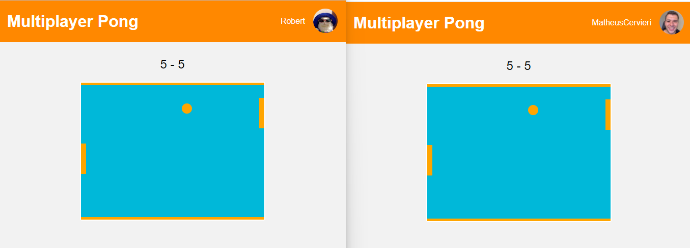
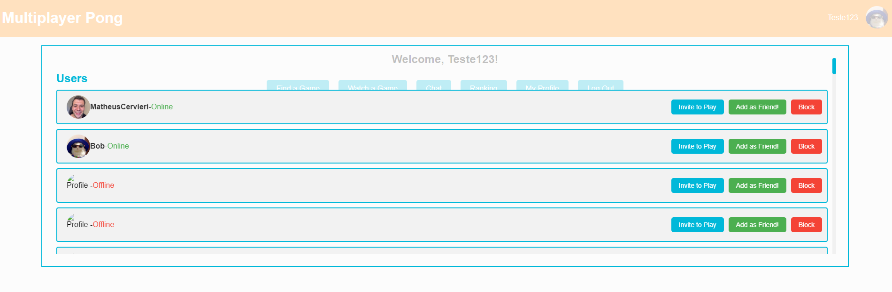
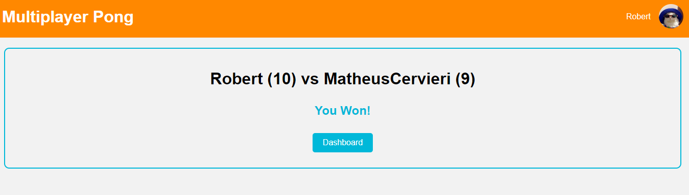

sudo chmod -R 777 pgdata
# Multiplayer Pong Game And Social Networking Using React, Typescript, Node and Nestjs!

### Summary!

This fullstack website allows users to play the classic game of pong against others. it also features a range of impressive functionalities, including a login system, user profiles, a match-making system, a group chat interface, a DM system, a ranking system, a friends system, and a two-factor authentication system. This project offers an excellent opportunity to demonstrate technical proficiency across both frontend and backend development.

This is the final project of the core curriculum at 42 School (One of the top ten most innovative universities according to the WURI 2021 ranking). I completed this project on my own. All projects at 42 School go through three evaluations, and you can see the requirements for delivering the project at the end of this page.

## Main Technologies

* Frontend: React, Typescript, Styled Components.
* Backend: Nest.js, Node.js, Express.js, PostgreSQL.
* Authentication: Passport, JWT.
* 2FA: SendGrid API.

## Visual Overview

Dashboard:


Private Profile:


Online Multiplayer Game:



Public Chat Room:


Users Modal:



Friends Modal:


Ranking:


Chat Rooms:


Room Adm Panel:


Final Game Scream:




### Setup - Como Usar o Programa!

O primeiro passo para executar o programa é rodar um "make" dentro do diretório. 

```
make
```

Depois disso, você precisa rodar os programas seguindo a seguinte ordem:

```
./Encoder
```

```
./Decoder
```

```
./Encoder
```

A primeira vez que o ./Encoder for rodado você precisa passar para ele parâmetros para ele saber que tipo de texto você quer comprimir.

O programa aceita dois tipos de parâmetros.

A maneira mais simples de usar é passar um texto ou múltiplos textos para o encoder como no exemplo abaixo:


Um único texto:
```
./Encoder "This text will be compressed"
```

múltiplos textos:
```
./Encoder "This text will be compressed" "This will be compressed too" This will be compressed to.
```

Você também tem a opção de passar arquivos, ou, múltiplos arquivos de texto para o programa. Para isso você precisa passar a flag "-f" e passar o diretório do arquivo:

```
./Encoder -f thisfilewillbecompressed.txt
```

Você também pode passar múltiplos arquivos: 
```
./Encoder -f thisfilewillbecompressed.txt text2.txt text3.txt text4.txt 
```

Depois de rodar o encoder com o texto que você quer que seja comprimido, você precisa rodar o decoder.

Para rodar o decoder é bem simples:

```
./Decoder
```

Depois de ter rodado o ./Decoder, você precisa rodar o ./Encoder novamente.

```
./Encoder
```

Se você fez tudo certo, ao rodar o Encoder pelo segunda vez, você deve receber esse tipo de mensagem na tela:


## Sumário

*  [Resumo](#resumo)
*  [Setup - Como Usar o Programa!](#setup---como-usar-o-programa)
*  [Explicação geral do Encoder!](#explicação-geral-do-encoder)
*  [Algoritimo de Huffman!](#algoritimo-de-huffman)
*  [Shared Memory!](#shared-memory)
*  [Quais informações enviamos para o decoder?](#quais-informações-enviamos-para-o-decoder)
*  [Explicação geral do Decoder!](#explicação-geral-do-decoder)
*  [Desafio](#desafio)


### Explicação geral do Encoder!

Vou fazer uma explicação geral do Encoder tendo como ponto de partida a main do programa. Essa é a main:


```
int	main(int argc, unsigned char **argv)
{
	t_data	*data;

	data = malloc(sizeof(t_data));
	read_from_decoder(data);
	is_there_decoded_information(data);
	if (read_input(argc, argv, data) == 1)
	{
		free(data->text);
		free(data);
		exit(0);
	}
	free(data->decoded_string);
	free(data->information_array);
	basic_init(data);
	printf("Start encoding...\n");
	make_tree(data);
	share_memory(data);
	free_data(data);
	printf("Encoding is finished, open Decoder program!\n");
}
```

O projeto começa definindo um struct t_data onde eu armazeno a maior parte das váriaveis que serão utilizadas no projeto. Fiz dessa forma para ficar mais organizado, e para ter fácil acesso a todas as váriaveis em várias funções diferentes. 

Depois disso, nós já usamos o shared memory operations para ver se no espaço de memória compartilhada já temos alguma informação que veio do decoder. Se tiver alguma informação no decoder, simplesmente , precisamos printar essa informação. Se não houver inforamção, precisamos executar o encoder normalmente. 

Ou seja, o encoder pode ter dois comportamentos. Ou ele vai encodificar (comprimir) um texto, ou ele vai printar informações de decodificação na tela. Se ele for printar as informações de decodidicação, nós printamos as informações que vieram do shared memory operations, damos free na meória que precisa receber free, e fechams o programa usando exit. Veja:

```
void	is_there_decoded_information(t_data *data)
{
	if (strlen((char *)data->decoded_string) != 0)
	{
		printf("Decoded data:\n%s\n\n", data->decoded_string);
		printf("----------------------------------------------\n\n");
		printf("Total amount of bytes: %i bytes \n", data->information_array[0]);
		printf("Encoded bytes (Bytes comprimidos): %i bytes \n", data->information_array[1]);
		printf("Time of decoding operation: %f secs\n",
			(float) data->information_array[2] / CLOCKS_PER_SEC);
		free(data->decoded_string);
		free(data->information_array);
		free(data);
		exit(0);
	}
}
```
Bem, caso não tenha informação do decoder no shared memory operation, nós vamos para o que realmente interessa. Encodificar o texto recebido.

A primeira parte é simplesmente ler o input do usuário.

```
if (read_input(argc, argv, data) == 1)
{
	free(data->text);
	free(data);
	exit(0);
}
```

Essa função readinput lê o argv do programa, e transforma o argv em uma string. Por exemplo, ao digitar:

```
./Encoder "This text will be compressed" "This two" "Me too"
```

O programa vai percorrer o argv e vai formar uma única string com o conteudo de todas as strings.

Se utilizarmos a flag "-f", o programa vai abrir os arquivos e formar uma única string com o conteúdo em texto dos arquivos. 

Como no exemplo:
```
./Encoder -f teste.txt teste2,txt 
```

Bem, depois disso, já damos free em algumas coisas que temos que dar, e iniciamos algumas váriaveis do nosso struct que precisamos iniciar. 

É nesse momento que passamos pelo primeiro desafio do projeto. Encodificar um texto usando o algoritmo de Huffman. 

#### Algoritimo de Huffman!

O algoritimo de huffman é bem mais simples do que parece (afinal Huffman é um nome imponente que representa poder kkkkk). Para executar ele, precisamos seguir os seguintes passos:

1- Ler o texto e gerar a tabela de frequência.
2- Gerar a lista / fila com Nós da árvore.
3- Gerar a árvore.
4- Gerar o dicionário (tebela de códigos)
5- Codificar o texto. Encoding.

Depois de fazer isso é necessário transformar a cadeia de caracteres com 0 e 1 em bits. Essa é a parte mais difícil do projeto (pq eu nunca tinha feito nada parecido). 

1- Ler o texto e gerar a tabela de frequência.

Precisamos gerar uma tabela com a quantidade de vezes que cada caracter aparece no texto, isso é bem simples:

```
void	make_frequency_table(t_data *data)
{
	unsigned char	*text;
	unsigned char	*first_position;

	text = strdup((char *)data->text);
	first_position = text;
	while (*text)
	{
		data->frequency_table[(int)*text]++;
		text++;
	}
	free(first_position);
}
```

2- Gerar a lista / fila com Nós da árvore.

Nós precisamos transformar nossa tabela de frequência em uma lista com nós em ordem crescente (de preferência).

Os nós de huffman são feitos da seguinte forma:

```
typedef struct node {
	int			weight;
	unsigned char		c;      
	struct node	*left; 
	struct node	*right; 
}	t_node;

```

Basicamente armazenamos em cada nó o caracter e a quantidade de vezes que esse caracter aparece (weight). Também podemos armazenar o nó que está na esquerda e na direita (para efetivamente conseguir montar a árvore).

Para criar a lista, criamos um array de nós (a estrutura de dados mais fácil) e adicionamos a cada elemento dessa estrutura um novo nó utilizando essa função:

```
t_node	*create_node(unsigned char c, int frequency)
{
    t_node	*node;

    node = calloc(1, sizeof(t_node));
    node->c = c;
    node->weight = frequency;
    node->left = NULL;
    node->right = NULL;
    return (node);
}
```

Se você observar o código que está em create_list.c, além de criar os nós eu também coloco eles em ordem crescente. 

3- Gerar a árvore.

Essa foi a função que eu usei para gerar a árvore:

```
t_node	*create_h_tree(t_node **nodes, t_data *data)
{
	int size;
	
	size = data->list_size;
	while (nodes[1])
	{
		nodes[0] = combine_nodes(nodes[0], nodes[1]);
		short_array(nodes);
		size--;
		quicksort(nodes, size);
	}
	return (nodes[0]);
}
```

E essss são os passos:

Nas primeira linhas declaramos as váriaveis. 

O while começa, testando se há mais de um nó no array.

Se houver, a função "combine_nodes" é chamada, combinando os dois primeiros nós do array. 

Depois chamamos a função "short_array", removendo o segundo nó do array.

Vamos reduzindo o "size" já que a lista de nós vai diminuindo.

Chamamos quicksort para ordenar o array.

O loop vai continuar até que o array tenha apenas um nó.

No fim retornamos o primeiro nó como o root (raiz) da árvore.

4- Gerar o dicionário (tebela de códigos)

Aqui precisamos gerar o código que vai gerar o dicionário. 

O dicionário seria o seguinte:

A letra a é representada pelo códgigo 1010 (Por exemplo). E, assim, sucessivamente para todas as letras que aparecem. 

Bem, para explicar como fazer o dicionário, mais fácil que explicar o código, é explicar escrevendo mesmo. 

Você vai percorrer a árvore começando pelo nó raiz. 

Se o nó atual tem um filho a esquerda, você adicdiona um "0" ao código atual e vai para esse nó. Se o nó atual tem um filho a direita, tu adiciona um "1" e vai para esse nó.

Você vai repetir o processo até chegar no nó que contém o caracter que você quer. 

Imagine essa árvore

```
     *
   /   \
  a     *
      /   \
     b     c
```

Se você quer saber o codigo de 'a', você começa no nó raiz e vê que 'a' está à esquerda, então adiciona "0" ao código atual, que agora é "0". Como 'a' é uma folha, você chega ao seu destino, então o código de 'a' é "0"

Se você quer saber o codigo de 'b', você começa no nó raiz, adiciona "1" ao código atual, e segue para o nó à direita. Como 'b' está à esquerda, adiciona "0" ao código atual. Então você chega ao seu destino, então o código de 'b' é "10"

Esse processo é feito para cada caractere armazenando-o e seu codigo correspondente no nosso dicionário.

O meu código para isso foi:

```
void put_in_dictionary(unsigned char **code, t_node *root, unsigned char *current_code, int code_length)
{
    unsigned char left_code[code_length];
    unsigned char right_code[code_length];

    if (root->left == NULL && root->right == NULL) 
    {
        strcpy((char *)code[(int)root->c], (char *)current_code);
    } 
    else 
    {
        strcpy((char *)left_code, (char *)current_code);
        strcpy((char *)right_code, (char *)current_code);
       (char *)(char *)left_code, "0");
       (char *)(char *)right_code, "1");

        put_in_dictionary(code, root->left, left_code, code_length);
        put_in_dictionary(code, root->right, right_code, code_length);
    }
}
```

Declara duas strings chamadas "left_code" e "right_code" com o tamanho de "code_length".

Se o nó atual é uma folha (não possui filhos), a função copia o "current_code" para o elemento do dicionário correspondente ao caractere armazenado no nó.

Se o nó atual não é uma folha, a função copia "current_code" para "left_code" e "right_code". Então adiciona "0" ao final do "left_code" e "1" ao final do "right_code".

Fazemos uma recursiva, passando o "left" e "right" como nós e "left_code" e "right_code" como current codes.

Dessa forma, a função percorre a árvore e atribui códigos a cada caracter. É chatinho de explicar porque é uma recursiva. Sendo sincero, para essa aqui, só segui os tutoriais mesmo kkkkk. 

OBS: Os códigos podem ficar um pouco estranhos aqui, mas nos arquivos eles estão mais organizados (ainda não acabei de organizar os arquivos).

Depois de fazer o dicionário, precisamos encodificar o texto realmente.

5- Codificar o texto. Encoding.

```
unsigned char *encode(unsigned char **dictionary, unsigned char *text) 
{
    int text_len = strlen((char *)text);
    unsigned char *encoded = calloc(text_len * 8 + 1, sizeof(unsigned char)); //allocate space for encoded text
    int encoded_len = 0;
    for (int i = 0; i < text_len; i++) {
        unsigned char *code = dictionary[(int)text[i]];
        for (int j = 0; j < (int)strlen((char *)code); j++) {
            encoded[encoded_len++] = code[j];
        }
    }
    encoded[encoded_len] = '\0'; //null-terminate encoded string
    return encoded;
}
```

Esse foi o código que usei para encodificar (ele ainda está desorganizado, mas vamos lá)

Essa parte é fácil, é só iterar a string e atribuir o valor do dicionário correspondente a cada unsigned char formando uma nova cadeia de caracteres. 

Bem, depois de tudo isso, temos uma string final com 0 (zeros) e 1(uns).

Algo tipo isso:

"110100000111100000111100001"

Se você for um pouco atento na hora de criar seu código e tiver o básico de conhecimento em programação, vai perceber que a string gerada ocupa mais espaço que a string original. 

Por exemplo, o texto "abcde" encodificado, teria um tamho maior, algo como "100110101010101".

Então, precisamos transformar essas cadeias de zeros e em bits efetivamente.

Vamos lá, cada zero e um é um bit. Ou seja, a string a seguir tem "10101010" tem 8 bits.

A cada 8 bit, temos 1 byte. 

Um unsigned char tem 1 byte, ou seja, 8 bits. 

Quando temos uma cadeia de unsigned chars "abcd" temos 32 bits ou 4 bytes.

Vamos supor que temos a string encodificada "10101010", ela tem 8 bytes mas ela representa 8 bits.

O que faremos agora é pegar essa string de 8 bytes e transformar em uma string de 1 byte que será representada pelos zeros e uns que estão aqui "10101010". 


Eu tirei essa imagem desse tutorial (que foi o que eu mais utilizei):https://www.youtube.com/watch?v=PGIl1gTSPns&list=PLqJK4Oyr5WShtxF1Ch3Vq4b1Dzzb-WxbP&index=2

Para fazer esse processo eu utilizei essa função

```
unsigned char *compress(unsigned char *bits_string)
{
    int i;
    int j;
    int z;
    unsigned char mask;
    unsigned char byte;
    unsigned char *compressed;
    compressed = calloc(get_size(bits_string), sizeof(unsigned char));
    i = 0;
    j = 7;
    z = 0;
    while(bits_string[i] != '\0')
    {
        mask = 1;
        if (bits_string[i] == '1')
        {
            mask = mask << j;
            byte = byte | mask;
        }
        j--;
        if(j < 0)
        {
            compressed[z] = byte;
            j = 7;
            byte = 0;
            z++;
        }
        i++;
    }
    if (j != 7)
        compressed[z] = byte;
    return(compressed);
}
```

Essa função foi feita com uma mistura de tutorial + githubcopilot + uma série de tentativas e erros kkkk.

Eu ainda não me aprofundei em operações binárias, mas o importante aqui é entender que:

No final uma string realmente comprimida será gerada. Essa string terá um conteúdo aleatório formado pelos bits da string encodificada "01010001110001". O conteúdo em unsigned char da string formada não importa muito. O que importa são os bits que tem nela. No decoder, vamos ler essa string comprimida e formar novamente a strings de zeros e uns. 

Bem, agora que temos uma string comprimida, devemos fazer a comunicação do encoder com o decoder. 

Para isso, utilizamos o shared memory operations. 

#### Shared Memory!

O shared memory operation permite que vários processos acessem e modifiquem a memória ao mesmo tempo. 

Eu já já irei explicar quais informações passamos através do shared memory operations e por quê.

Antes, vamos entender como os meus programas lidam com o shared memory.

Para facilitar a organização do projeto e o acesso a variáveis, eu criei um struct:

```
typedef struct memory{
	key_t		key;
	int			size; 
	int			block_id;
	unsigned char		*shared_memory; 
}	t_memory;
```

Esse struct facilitou muito a organização na hora de lidar com a memória. 

O key seria o código único da memória.

O size o tamanho da memória.

O block_id o id da memória. 

E, o shared_memory o ponteiro que aponta para a memória compartilhada. 

De forma simples, no meu programa, quando queremos enviar algo para a memória compartilhada, fazemos o seguinte:

```
data->compressed_memory = malloc(sizeof(t_memory));
	start_shared_memory(data->compressed_memory, strlen((char *)data->compressed_string) + 1, 'Z');
	write_memory(data->compressed_memory, data->compressed_string, strlen((char *)data->compressed_string) + 1);
	detach_shared_block(data->compressed_memory);
```

Alocamos o struct (data->compressed_memor) 

Chamamos a função start_shared_memory:

```
void start_shared_memory(t_memory *memory, int size, char key)
{
    set_key(memory, "./", key);
    set_shared_block(memory, size);
    attach_shared_block(memory);
}

void set_key(t_memory *memory, char *path, char key)
{
    memory->key = ftok(path, key);
}

void set_shared_block(t_memory *memory, int size)
{

    memory->block_id = shmget(memory->key, size, 0666 | IPC_CREAT);
}

```

Resumindo, criamos um key único baseando-se em um arquivo e em um caracter. Isso permite que acessemos a mesma mória em outro programa. Cada memória compartilhada terá o seu key único.

Depois disso chamamos o shmget que obtem um segmento da memória compartilhada e retorna um id para esse segmento. 

Depois utilizamos:

```
void attach_shared_block(t_memory *memory)
{
   
    memory->shared_memory = shmat(memory->block_id, NULL, 0);
}
```

Isso, basicamente, permite que o nosso processo modifique a memória em determinada região. 

Depois, efetivamente, escrevemos na memória usando: 

```
void write_memory(t_memory *memory, unsigned char *buffer, int size)
{
    memcpy(memory->shared_memory, buffer, size);
}
```

A memória compartilhada está sendo representada pela cadeia de unsigned chars shared_memory dentro do meu struct t_memory. 

Podemos manipular essa memória "normalmente" usando funções como memcpy. Basicamente, na função acima escrevemos o conteúdo de buffer na memória compartilhada. 

Por último, chamamos essas duas funções:


```
void detach_shared_block(t_memory *memory)
{
    
    shmdt(memory->shared_memory);
}

```

Essa função desanezxa um segmento da memória do processo. 

Para ler da memória usando o "Shared Memory Operations" fazemos algo parecido:


```
    start_read_memory(data->compressed_memory, 'Z').
	data->compressed_string = read_memory(data->compressed_memory);
	detach_shared_block(data->compressed_memory);
	delete_shared_block(data->compressed_memory);
```

Afim de facilitar a explicação, as principais diferenças são:

```
unsigned char *read_memory(t_memory *memory)
{
    unsigned char *readed_memory;

    readed_memory = malloc(sizeof(unsigned char) * memory->size);
    memcpy(readed_memory, memory->shared_memory, memory->size);
    return (readed_memory); 
}
```

A função readmemory pega o conteúdo do memory->shared_memory e escreve com memcpy em uma nova string que alocamos. O size dessa string é obtido aqui usando o struct shmid_ds shm_info:

```
void start_read_memory(t_memory *memory, char key)
{
    struct shmid_ds shm_info;

    shm_info.shm_segsz = 0;
    set_key(memory, "./", key);
    set_shared_block(memory, 0);
    if (shmctl(memory->block_id, IPC_STAT, &shm_info) < 0) 
    {
        //perror("shmctl");
    }
    if (shm_info.shm_segsz > 0)
        memory->size = shm_info.shm_segsz;
    else
        memory->size = 0;
    attach_shared_block(memory);
}
```

Além disso, depois de ler o segmento da memória, não precisamos mais dele, e podemos deletar o segmento, usando:

```
void delete_shared_block(t_memory *memory)
{
    shmctl(memory->block_id, IPC_RMID, NULL);
}
```

Acredito que essa é uma boa explicação geral do shared memory operations dentro do meu código. 


### Quais informações enviamos para o decoder?

Bem, depois de ter explicado brevemente como usei o "Shared Memory Operation" gostaria de registrar quais inforamções enviei para o decoder. 

Eu enviei 3 informações para o decoder utilizando 3 "shared memory" diferentes:

1- A string compactada, ou seja, a string que sofreu o encoder mais a compressão.

2- A tabela de frequência. 

3- O tamanho da string encodificada.

Por que?

1- A string compactada, ou seja, a string que sofreu o encoder mais a compressão.

Enviei essa informação porque é o objetivo do projeto. Fiquei bem feliz porque consegui comprimir a string depois que ela passou pelo algoritmo de huffman como expliquei anteriormente. 

2- A tabela de frequência.

Enviei a tabela de frequência para conseguir remontar a árvore no decoder.

3- O tamanho da string encodificada.

Enviei o tamanho da string encodificada porque na hora que comprimimos a string temos que decodificar ela com alguns bits a mais caso o texto comprimido não seja multiplo de 8. No decoder, eu uso essa informação para saber quais são so bits a mais e não utilizar eles.
Acredito que possa haver uma maneira mais inteligente de fazer isso, mas não achei. 

Bem, analisando o projeto e o seu objetivo, poderia ter feito mais algumas coisas aqui.

A primeira era ter enviado somente os caracteres utilizandos na tabela de frequência e transformando a tabela de frequência em uma tabela de unsigned chars isso teria deixado a tabela de frequência ainda menor. Ou seja, se o objetivo era reduzir o tamanho da informação, isso teria funcionado bem. 

A segunda coisa que poderia ter feito era enviado todas as informações em uma única memória compartilhada. O projeto não especificou isso, e não vi ninguém fazendo isso. Mas, se refletirmos sobre um processo de compressão, quando comprimimos um arquivo, ficamos só com um arquivo e não com múltiplos arquivos. Acredito que isso teria deixado o projeto mais realista.

Depois de enviar as informações para o decoder, liberamos a memória que temos que liberar:


Agora vamos explicar brevemente o decoder. 

### Explicação geral do Decoder!

Depois de entender tudo o que foi explicado até aqui, entender o decoder é muito fácil. 

Essa é a main do meu decoder:

```
int	main(void)
{
	t_data		*data;
	int			*frequency_table;
	int			time;
	int			*size;

	data = malloc(sizeof(t_data));
	read_encoder_memory(data, &frequency_table, &size);
	write_frequency_table(data, frequency_table);
	start_decoding(data, &time, *size);
	set_decoded_information(data, time, *size);
	write_memory_for_encoder(data);
	free_data(data);
	free(size);
	free(frequency_table);
	free(data);
}
```

Assim como no Encoder, também utilizamos um struct data para facilitar. 

A primeira função é o read_encoder_memory(). Essa função basicamente vai ler e receber as informações do "Shared Memory Operations" que foram compartilhadas pelo encoder seguindo a lógica explicada anteriormente. As informações, como também falado anteriormente, são essas:

1- A string compactada, ou seja, a string que sofreu o encoder mais a compressão.

2- A tabela de frequência. 

3- O tamanho da string encodificada.

Se não tiver informações para ler, o decoder vai retornar esse erro: 


Isso é feito no "if" desse código:

```
int start_read_memory(t_memory *memory, char key)
{
    struct shmid_ds shm_info;

    set_key(memory, "./", key);
    set_shared_block(memory, 0);
    if (shmctl(memory->block_id, IPC_STAT, &shm_info) < 0) 
    {
        return (1);
    }
    memory->size = shm_info.shm_segsz;
    attach_shared_block(memory);
    return (0);
}
```

```
if (start_read_memory(data->compressed_memory, 'Z') == 1)
	{
		printf("There is no encoded data to decode!\n");
		free(data->compressed_memory);
		free(data);
		exit(1);
    }
```

Depois disso, a gente passa as informações sobre a tabela de frequência da memória compartilhada para uma tabela de frequência:

```
void    write_frequency_table(t_data *data , int *frequency_table)
{
	int i = 0;
	while (i < 256)
	{
		data->frequency_table[i] = frequency_table[i];
		i++;
	}
}
```

Depois disso, nós executamos as funções para montar a árvore utilizando a tabela de frequência na função start_decoding(data, &time, *size);

O que tem diferente do que já foi falado nessa função é que calulamos o tempo de descompressão usando a função clock() da biblioteca time.h.

Além disso, descomprimimos a string recebida em uma string com os bits com a função descompress string:

```
unsigned char *descompress_string(unsigned char *compressed_string, int size)
{
    unsigned char byte;
    unsigned char *descompressed;
    unsigned char *descompressed_right_size;
    int i = 0;
    int z = 0;
    
    descompressed = calloc(strlen((char *)compressed_string) * 10, sizeof(unsigned char));
    while(compressed_string[i] != '\0')
    {
        byte = compressed_string[i];
        for (int i = 7; i >= 0; i--)
        {
            if (byte & (1 << i))
            {
                descompressed[z] = '1';
                z++;
            }
            else
            {
                descompressed[z] = '0';
                z++;
            }
        }
        i++;
    }
    descompressed_right_size = make_write_size(descompressed, size);
    free(descompressed);
    return (descompressed_right_size);
}
```

Essa função segue a lógica da função de compressão explicada no encoder. 

Depois disso, chamamos a função set_decoded_information(data, time, *size):

```
void	set_decoded_information(t_data *data, int time, int size)
{
	data->decode_information[0] = strlen((char *)data->decoded_data);
	data->decode_information[1] = strlen((char *)data->decoded_data) - (size / 8);
	data->decode_information[2] = time;
}
```

Basicamente ela define as informações de descompressão em um array. 

Depois disso, a gente envia para o encoder duas informações através dessa função que usa os conceitos explicados sobre "Shared Memory Operations":

1- O array com as informções de descompressão.
2- A mensagem descomprimida. 

Por fim, liberamos a memória no que precisamos liberar e:


## Desafio

O desafio consiste no desenvolvimento de uma aplicação de análise e compressão de dados. Essa aplicação utilizará o algoritmo de compressão Huffman e poderá receber múltiplos dados onde, uma vez que comprimido deve ser descomprimido e coletar informações pertinentes para a análise do processo e dado.

Para isso, você criará dois programas: `encoder` e `decoder`. O encoder receberá o dado a ser comprimido e exibirá suas informações vindas do decoder. Já, o decoder descomprimirá o dado e irá enviá-lo ao encoder com suas informações, onde será exibido. Os programas devem se comunicar utilizando *shared memory operations*.

A linguagem C será utilizada para o desenvolvimento e não há bibliotecas externas permitidas.

## É necessário

- Que existam dois programas `encoder` e `decoder` que se comuniquem via memória compartilhada.
- Que o `encoder` possa receber, no mínimo, múltiplos textos como dado e comprimi-lo. Caso mais de um texto seja enviado, devem ser comprimidos juntos, resultando em apenas um único dado.
- Que o algoritmo de Huffman seja implementando em sua totalidade e que o processo de compressão e descompressão ocorram utilizando-o.
-  Que o `decoder` possa descomprimir e enviar as seguintes informações ao `encoder`: dado descomprimido, quantidade de bits ou bytes totais, quantidade de bits ou bytes comprimidos e o tempo da operação de descompressão.
- O `encoder` exibir as informações recebidas pelo `decoder`.

### O que será avaliado

- Código bem escrito e limpo.
- A documentação do seu código.
- Ferramentas que foram utilizadas e por quê.
- Sua criatividade e capacidade de lidar com problemas diferentes.
- Alinhamento do seu projeto com a proposta.

### O mínimo necessário

- README.md com a documentação contendo informações do projeto.

### Bônus

Os itens a seguir não são obrigatórios, mas são funcionalidades que darão mais valor ao seu desafio.

- Compressão de múltiplos arquivos binários.
- Criptografia do dado comprimido, utilizando senha fornecida pelo usuário.
- Verificação de integridade do arquivo comprimido.
- Opção para escolher mais outro algoritmo de compressão a ser utilizado.
- Tempo de descompressão (`decoder`) abaixo da média dos candidatos.
- Cuidados especiais com otimização e padrões de código.
- Uso de ferramentas externas para planejamento nas etapas de desenvolvimento.