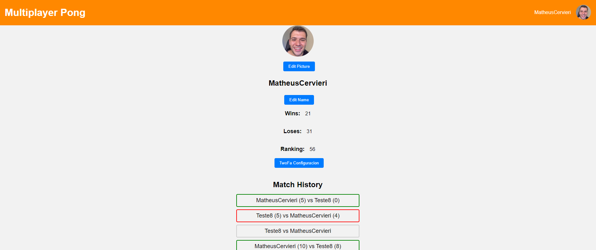
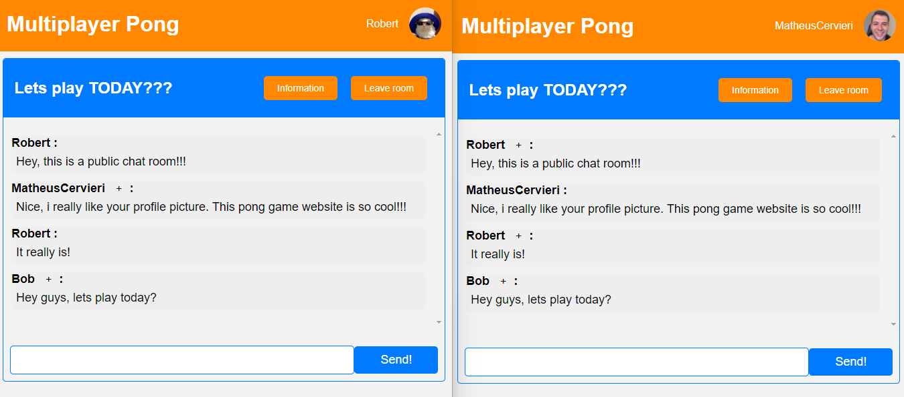
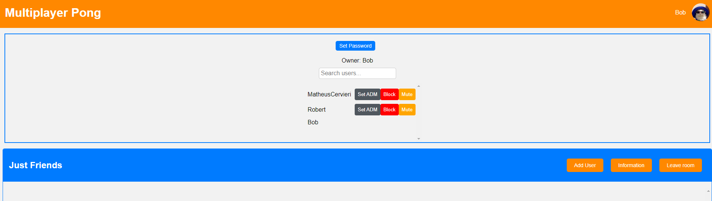

sudo chmod -R 777 pgdata
# Multiplayer Pong Game And Social Networking Using React, Typescript, Node and Nestjs!

### Summary!

This fullstack website allows users to play the classic game of pong against others. it also features a range of impressive functionalities, including a login system, user profiles, a match-making system, a group chat interface, a DM system, a ranking system, a friends system, and a two-factor authentication system. This project offers an excellent opportunity to demonstrate technical proficiency across both frontend and backend development.

This is the final project of the core curriculum at 42 School (One of the top ten most innovative universities according to the WURI 2021 ranking). I completed this project on my own. All projects at 42 School go through three evaluations, and you can see the requirements for delivering the project at the end of this page.

## Main Technologies

* Frontend: React, Typescript, Styled Components.
* Backend: Nest.js, Node.js, Express.js, PostgreSQL.
* Authentication: Passport, JWT.
* 2FA: SendGrid API.
* Others: Docker and Docker Compose.

## Visual Overview

Dashboard:


Private Profile:



Online Multiplayer Game:


Public Chat Room:



Users Modal:


Friends Modal:


Ranking:


Chat Rooms:


Room Adm Panel:



Final Game Scream:


There are additional functionalities in the game. At the end of this README, I will provide a list of all the requirements and tasks completed for this project.

Remove the database: rm -rf ./pgdata

### Setup - Como Usar o Programa!

O primeiro passo para executar o programa é rodar um "make" dentro do diretório. 

```
make
``` 
### What i did?!

O primeiro passo para executar o programa é rodar um "make" dentro do diretório. 

<List>
        <li>The website allows users to play real-time multiplayer Pong games with a chat feature and complies with specific rules, including using Node and NestJS for the backend, a TypeScript and React for the frontend, and PostgreSQL for the database.</li>
        <li>The User Account section of the website allows users to log in using the OAuth system of 42 intranet API, choose a unique name and avatar, enable two-factor authentication, add friends, view their status, display their stats, and have a match history including 1v1 games and ladder.</li>
        <li>The website's chat feature allows users to create public, private or password-protected channels, send direct messages and block other users, while channel owners can set a password, remove it, and appoint other administrators who have specific permissions to kick, ban or mute users, as well as invite users to play Pong games and access their profiles.</li>
        <li>The website is designed to allow users to play live Pong games against each other and features a matchmaking system for finding opponents, a customizable Pong game that is true to the original 1972 version, and the ability to select a default version without any extra features. The game is also responsive to ensure optimal gameplay.</li>
        <li>Ensuring full functionality of the website necessitates tackling security concerns such as hashing any stored passwords, safeguarding against SQL injections, and incorporating server-side validation for forms and user input.</li>
</List>


## Sumário

*  [Resumo](#resumo)
*  [Setup - Como Usar o Programa!](#setup---como-usar-o-programa)
*  [Explicação geral do Encoder!](#explicação-geral-do-encoder)
*  [Algoritimo de Huffman!](#algoritimo-de-huffman)
*  [Shared Memory!](#shared-memory)
*  [Quais informações enviamos para o decoder?](#quais-informações-enviamos-para-o-decoder)
*  [Explicação geral do Decoder!](#explicação-geral-do-decoder)
*  [Desafio](#desafio)


