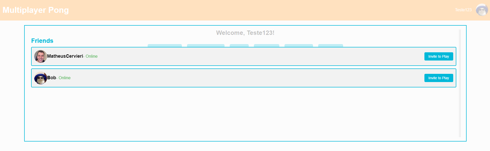
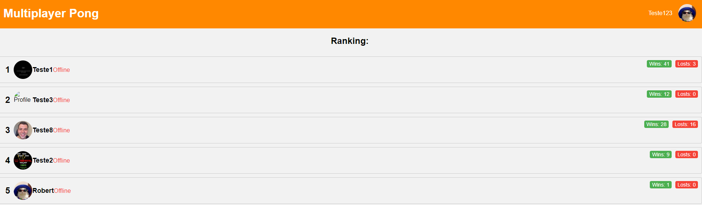

sudo chmod -R 777 pgdata
# Multiplayer Pong Game And Social Networking Using React, Typescript, Node and Nestjs!

### Summary!

This fullstack website allows users to play the classic game of pong against others. it also features a range of impressive functionalities, including a login system, user profiles, a match-making system, a group chat interface, a DM system, a ranking system, a friends system, and a two-factor authentication system. This project offers an excellent opportunity to demonstrate technical proficiency across both frontend and backend development.

This is the final project of the core curriculum at 42 School (One of the top ten most innovative universities according to the WURI 2021 ranking). I completed this project on my own. All projects at 42 School go through three evaluations, and you can see the requirements for delivering the project at the end of this page.

## Main Technologies

* Frontend: React, Typescript, Styled Components.
* Backend: Nest.js, Node.js, Express.js, PostgreSQL.
* Authentication: Passport, JWT.
* 2FA: SendGrid API.
* Others: Docker and Docker Compose.

## Visual Overview

Dashboard:


Private Profile:


Online Multiplayer Game:


Public Chat Room:


Users Modal:


Friends Modal:



Ranking:



Chat Rooms:


Room Adm Panel:


Final Game Scream:


There are additional functionalities in the game. At the end of this README, I will provide a list of all the requirements and tasks completed for this project.

Remove the database: rm -rf ./pgdata

### Setup - How to Use?

O primeiro passo para executar o programa é rodar um "make" dentro do diretório. 

```
make
``` 
### What was done in the project?!

<List>
        <li>The website allows users to play real-time multiplayer Pong games with a chat feature and complies with specific rules, including using Node and NestJS for the backend, a TypeScript and React for the frontend, and PostgreSQL for the database.</li>
        <li>The User Account section of the website allows users to log in using the OAuth system of 42 intranet API, choose a unique name and avatar, enable two-factor authentication, add friends, view their status, display their stats, and have a match history including 1v1 games and ladder.</li>
        <li>The website's chat feature allows users to create public, private or password-protected channels, send direct messages and block other users, while channel owners can set a password, remove it, and appoint other administrators who have specific permissions to kick, ban or mute users, as well as invite users to play Pong games and access their profiles.</li>
        <li>The website is designed to allow users to play live Pong games against each other and features a matchmaking system for finding opponents, a customizable Pong game that is true to the original 1972 version, and the ability to select a default version without any extra features. The game is also responsive to ensure optimal gameplay.</li>
        <li>Ensuring full functionality of the website necessitates tackling security concerns such as hashing any stored passwords, safeguarding against SQL injections, and incorporating server-side validation for forms and user input.</li>
</List>


## Index

*  [Summary](#Summary!)
*  [Main Technologies](##Main-Technologies)
*  [Explicação geral do Encoder!](#explicação-geral-do-encoder)
*  [Algoritimo de Huffman!](#algoritimo-de-huffman)
*  [Shared Memory!](#shared-memory)
*  [Quais informações enviamos para o decoder?](#quais-informações-enviamos-para-o-decoder)
*  [Explicação geral do Decoder!](#explicação-geral-do-decoder)
*  [Desafio](#desafio)


### Requirements

# Mandatory part

## I - 1 Overview

In this subject you will need to build a website for the mighty pong contest.
Your website will help user run pong tournament and play against each other.
There will be an admin view, chat with moderators, real time multiplayer online
games.
There will be guilds and wars!
You will need to follow thoses rules:

-   you must use the last stable version of every frameworks or libraries.
-   Your website backend should be written in NestJS.
-   You must use a postgresql database and no other databases.
-   The front end must be written with any typescript framework.
-   Your website should be a single page app, but user should be able to use the back
    button on the browser https://en.wikipedia.org/wiki/Singlepage_application
-   Your website must be usable on the latest version to date on Google Chrome,
    Firefox, Safari.
-   There must be no unhandled errors or warning when browsing through the website.
-   You can use any library.
-   Everything should run with a single call to docker-compose up –build

## I - 2 Security concerns

Because you are creating a fully-working website, there are a few security concerns that
you will have to tackle

-   Any password stored in your database must be encrypted
-   Your website must be protected against SQL injections
-   You must implement some kind of server-side validation for forms and any user
    input

## I - 3 User Account

-   A user must login using the oauth system of 42 intranet
-   A user must be able to choose a unique name that will be displayed on the website
-   A user has a number of victory and loss and other stats (ladder level, number of
    won tournaments, achievements etc...)
-   A user must have an avatar generated or uploaded by the user
-   A user must be able to activate a 2 factor authentication (like google authenticator
    or a sms etc...)
-   A user can be in 1 guild at a time
-   A user can add other users as friends, and see their current status (online, offline,
    in a game...)
-   Each user has a match history (including duel, ladder or tournaments games) that
    can be consulted by anyone logged-in

## I - 4 Chat

-   Users must be able to create channels public/private or protected by a password
-   Users must be able to send direct messages to other user
-   Users must be able to block other user and therefore they will not see their messages
    anymore
-   A user that create a new channel is automatically its owner until he leaves the
    channel - owner of a channel can add/change/remove a password to access to the channel - owner can select user to be administrator and is also administrator of the
    channel - administrator can ban or mute users for a certain amount of time
-   Through the chat interface users should be able to ask other player to do a Pong
    match
-   Through the chat interface users must be able to see other players profiles


## I - 5 Game

- The main purpose of this website is to play pong against other players and show everyone
how good you are!
- Therefor we should be able to play pong directly on the website and live against an
other player. It can be in a canvas or it can be with 3d effects, it can be ugly but it must be a pong
like the one from 1972.
- If you want to, you can add power ups, different maps etc... but user must be able to
play a default pong game without any added stuff.
- The game must be responsive!
- Other users can watch the game live without interfering in it.